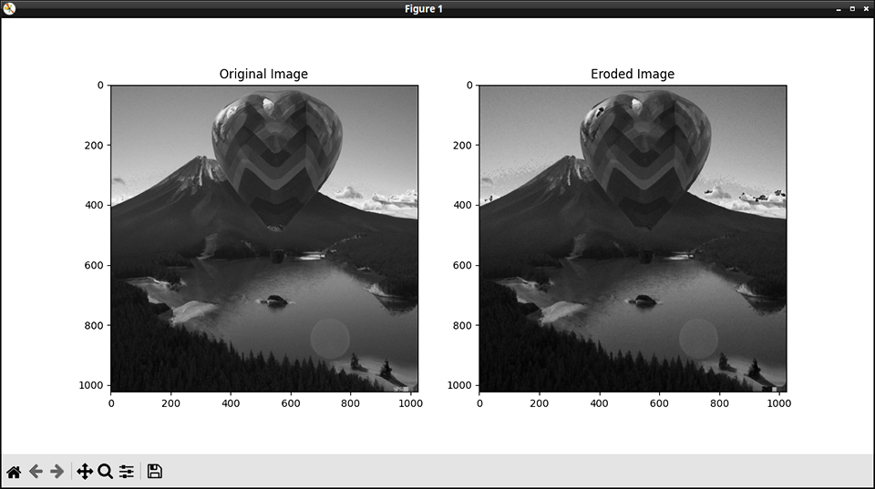

# OpenCV Erosion Demo

A demo of how to use erosion with OpenCV. 



This is code from my article, [Applying Erosion to Images with OpenCV: A Complete Guide.](https://www.jeremymorgan.com/tutorials/opencv/apply-erosion-images/)


Also featured on the [Computer Vision Power Hour](https://www.twitch.tv/jeremymorgan/schedule?vodID=1773385086)

## Running these files

Have Python installed on your machine.

Create a new Python environment.

run:

```
pip install -r requirements.txt
```

Enjoy!